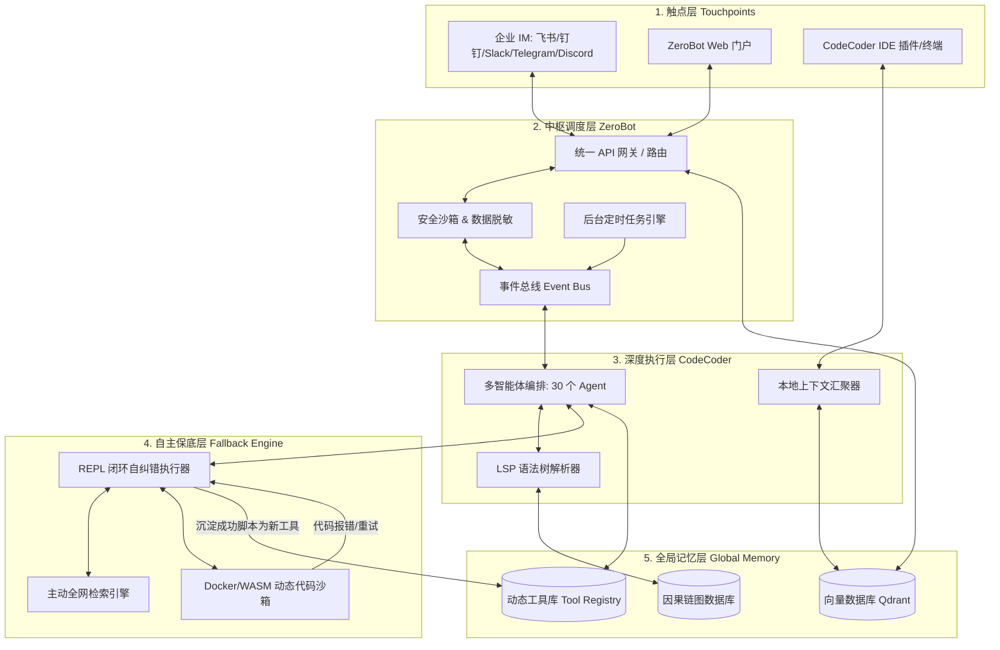

# CodeCoder 智擎工作舱 - 当前架构清单

> 生成时间: 2026-02-25
> 版本: 0.0.1 (开发中)

本文档记录 CodeCoder 项目当前已实现的架构和功能。

---

## 1. 系统概览

### 核心定位

CodeCoder 是一个个人工作台，融合工程能力与决策智慧。

**核心理念**: 自主研究、编程保底、全域协同

### 三层能力

| 层级 | 描述 |
| ------ | ------ |
| 工程层 | 代码审查、安全分析、TDD、架构设计、逆向工程 |
| 领域层 | 宏观经济、交易分析、选品策略、极小产品、AI 工程 |
| 思维层 | 祝融说哲学体系、CLOSE 决策框架、观察者理论 |

---

## 2. 五层一环架构



---

## 3. 服务架构

### 进程编排

```
┌─────────────────────────────────────────────────────────────────┐
│                      zero-cli daemon                            │
│                        (进程编排器)                              │
│  职责: spawn 子进程、健康检查、自动重启、日志聚合                  │
│              │                │                │                │
│              ▼                ▼                ▼                │
│       ┌──────────┐     ┌──────────┐     ┌──────────┐           │
│       │  zero-   │     │  zero-   │     │  zero-   │           │
│       │ gateway  │     │ channels │     │ workflow │           │
│       │  :4430   │     │  :4431   │     │  :4432   │           │
│       └──────────┘     └──────────┘     └──────────┘           │
└─────────────────────────────────────────────────────────────────┘
```

### 端口配置

#### 核心服务 (4400-4409)

| 端口 | 服务 | 技术栈 |
| ------ | ------ | -------- |
| 4400 | CodeCoder API Server | Bun/TypeScript |
| 4401 | Web Frontend (Vite) | React |
| 4402 | Zero CLI Daemon | Rust |
| 4403 | Faster Whisper Server | Docker (Python) |

#### 协议服务 (4420-4429)

| 端口 | 服务 | 协议 |
| ------ | ------ | ------ |
| 4420 | MCP Server (HTTP) | Model Context Protocol |

#### Rust 微服务 (4430-4439)

| 端口 | 服务 | 功能 |
| ------ | ------ | ------ |
| 4430 | Zero Gateway | 统一网关: 认证/路由/配额/MCP/Webhook |
| 4431 | Zero Channels | IM 渠道: Telegram/Discord/Slack 等 |
| 4432 | Zero Workflow | 工作流: Webhook/Cron/Git 集成 |

---

## 4. Monorepo 结构

### TypeScript Packages

| 路径 | 描述 |
| ------ | ------ |
| `packages/ccode/` | 核心 CLI 工具和业务逻辑 |
| `packages/ccode/src/cli/cmd/tui/` | 终端 UI (Solid.js + OpenTUI) |
| `packages/web/` | Web 前端 (React + Vite) |
| `packages/util/` | 共享工具 |
| `script/` | 项目级构建脚本 |

### Rust Services

| 路径 | 类型 | 描述 |
| ------ | ------ | ------ |
| `services/zero-cli/` | 可执行 | 主程序，包含 daemon 命令 |
| `services/zero-gateway/` | 可执行 | 统一网关服务 |
| `services/zero-channels/` | 可执行 | IM 频道服务 |
| `services/zero-workflow/` | 可执行 | 工作流服务 |
| `services/zero-agent/` | 库 | Agent 执行逻辑 |
| `services/zero-memory/` | 库 | 内存/持久化 |
| `services/zero-tools/` | 库 | 工具定义 |
| `services/zero-common/` | 库 | 共享配置和工具 |

---

## 5. Agent 清单 (30 个)

### 主模式 Agent (4 个)

| Agent | 描述 |
| ------- | ------ |
| `build` | 主要开发模式，代码构建和修改 |
| `plan` | 计划模式，架构设计和实现规划 |
| `writer` | 长文创作模式 (20k+ 字)，大纲、章节、风格一致性 |
| `autonomous` | 自主模式，使用 CLOSE 决策框架完全自主执行 |

### 逆向工程 Agent (2 个)

| Agent | 描述 |
| ------- | ------ |
| `code-reverse` | 网站逆向工程，像素级还原规划 |
| `jar-code-reverse` | JAR 逆向工程，Java 源码重建 |

### 工程质量 Agent (5 个)

| Agent | 描述 |
| ------- | ------ |
| `code-reviewer` | 代码审查，具体可执行的反馈 |
| `security-reviewer` | 安全漏洞分析和最佳实践 |
| `tdd-guide` | 测试驱动开发方法论 |
| `architect` | 系统架构设计，接口定义 |
| `verifier` | 形式化验证，构建/类型/测试检查 |

### 内容创作 Agent (5 个)

| Agent | 描述 |
| ------- | ------ |
| `expander` | 内容扩展，将想法发展为完整书籍 |
| `expander-fiction` | 小说扩展，世界观、角色弧、叙事结构 |
| `expander-nonfiction` | 非虚构扩展，论证框架、证据系统 |
| `proofreader` | 校对，使用 PROOF 框架检查语法、风格、结构 |
| `prd-generator` | PRD 生成，将会议纪要转化为结构化需求文档 |

### 祝融说系列 Agent (7 个)

| Agent | 描述 |
| ------- | ------ |
| `observer` | 观察者理论分析，可能性基底、观察收敛 |
| `decision` | CLOSE 五维决策框架，保持选择权和可用余量 |
| `macro` | 宏观经济分析，GDP/工业/投资/消费数据解读 |
| `trader` | 超短线交易指南，情绪周期、模式识别 |
| `picker` | 选品专家，七宗罪选品法、数据验证框架 |
| `miniproduct` | 极小产品教练，0到1 构建可盈利软件 |
| `ai-engineer` | AI 工程师导师，LLM 应用开发、RAG、微调 |

### 工具辅助 Agent (4 个)

| Agent | 描述 |
| ------- | ------ |
| `explore` | 快速代码库探索，文件搜索、关键词查找 |
| `general` | 通用 Agent，复杂问题研究和多步任务执行 |
| `synton-assistant` | SYNTON-DB 助手，张量图存储、PaQL 查询 |
| `feasibility-assess` | 技术可行性评估，输出结构化 JSON 报告 |

### 系统隐藏 Agent (3 个)

| Agent | 描述 |
| ------- | ------ |
| `compaction` | 上下文压缩 |
| `title` | 会话标题生成 |
| `summary` | 会话摘要生成 |

---

## 6. IM 渠道支持 (10 个)

| 渠道 | 状态 | 实现文件 |
| ------ | ------ | ---------- |
| Telegram | ☑️ | 通过 IM 框架支持 |
| Discord | ☑️ | 通过 IM 框架支持 |
| Slack | ☑️ | 通过 IM 框架支持 |
| 飞书 (Feishu) | ☑️ | `services/zero-channels/src/feishu.rs` |
| 钉钉 (DingTalk) | ☑️ | `services/zero-channels/src/dingtalk.rs` |
| 企业微信 (WeCom) | ☑️ | `services/zero-channels/src/wecom.rs` |
| Email | ☑️ | `services/zero-channels/src/email.rs` |
| iMessage | ☑️ | `services/zero-channels/src/imessage.rs` |
| WhatsApp | ☑️ | `services/zero-channels/src/whatsapp.rs` |
| Matrix | ☑️ | `services/zero-channels/src/matrix.rs` |

---

## 7. API 端点汇总

### CodeCoder TypeScript API

| 端点前缀 | 功能 |
| ---------- | ------ |
| `/api/agent/*` | Agent 调用和管理 |
| `/api/chat/*` | 会话交互 |
| `/api/mcp/*` | MCP 协议端点 |
| `/api/session/*` | 会话管理 |
| `/api/v1/dlp/*` | 数据脱敏 API |
| `/api/v1/router/*` | LLM 路由 API |
| `/api/v1/causal/*` | 因果链图 API |

### Zero Gateway Rust API

| 端点 | 功能 |
| ------ | ------ |
| `/auth/*` | 认证 (配对码 + JWT) |
| `/webhook` | Webhook 端点 |
| `/mcp` | MCP JSON-RPC 端点 |
| `/users/*` | 用户管理 CRUD + RBAC |
| `/quota/*` | 配额管理 |
| `/audit/*` | 审计日志 |

---

## 8. 技术栈

### 运行时

| 技术 | 版本 | 用途 |
| ------ | ------ | ------ |
| Bun | 1.3+ | TypeScript 运行时 |
| Rust | 1.75+ | 微服务运行时 |

### 构建系统

| 技术 | 用途 |
| ------ | ------ |
| Turborepo | TypeScript monorepo 构建 |
| Cargo Workspace | Rust 工作区管理 |

### 前端

| 技术 | 用途 |
| ------ | ------ |
| React | Web 前端 |
| Solid.js + OpenTUI | 终端 UI |
| TailwindCSS | 样式 |

### 后端

| 技术 | 用途 |
| ------ | ------ |
| Hono | TypeScript HTTP 框架 |
| Axum | Rust HTTP 框架 |
| Cloudflare Workers | 边缘部署 |

### AI 集成

| 提供商 | 状态 |
| -------- | ------ |
| Anthropic (Claude) | ☑️ |
| OpenAI (GPT) | ☑️ |
| Google (Gemini) | ☑️ |
| Ollama (本地模型) | ☑️ |
| OpenRouter | ☑️ |
| MCP 协议 | ☑️ |

---

## 9. 已实现里程碑

### Phase 0: 商业闭环与项目立项 ☑️

- [x] 架构设计 (Architecture V2) - 五层一环架构已落地

### Phase 1: 核心基座 (MVP) ☑️

- [x] ZeroBot 网关 (Rust Axum)
- [x] 飞书/钉钉 Webhook 打通
- [x] LLM Router 实现
- [x] DLP Filter 数据脱敏
- [x] Event Bus 事件总线
- [x] 标准工具集 (MCP 集成 + 30 Agent)

### Phase 2: Web 深度解析 🔄 进行中

- [x] Playwright 集成 (2026-02-18)
- [x] 认知缓存 / Schema 记忆库 (因果链图数据库)
- [x] 自纠错机制 (REPL 闭环)
- [ ] 前端 JS 逆向 AST 解析

### Phase 3: 移动端接管 ⬜ 待开始

- [ ] App 视觉控制 (Appium/ADB)
- [ ] 自动注册/找 Key
- [ ] 动态配额管理

---

## 10. 运维命令

```bash
# 启动服务
./ops.sh start          # 开发模式
./ops.sh start all      # 启动所有服务
./ops.sh stop           # 停止所有服务

# 状态检查
./ops.sh status         # 查看服务状态
./ops.sh health         # 健康检查
./ops.sh logs zero-daemon  # 查看日志

# 构建
./ops.sh build rust     # 构建 Rust 服务
bun turbo typecheck     # 类型检查
```

---

## 11. 配置文件

| 文件 | 用途 |
| ------ | ------ |
| `~/.codecoder/config.json` | 统一配置文件 |
| `memory/MEMORY.md` | 长期记忆 |
| `memory/daily/{YYYY-MM-DD}.md` | 每日笔记 |

> **注意**: 禁止使用 `.toml` 格式配置文件，统一使用 JSON。

---

*本文档由 CodeCoder 自动生成，反映 2026-02-25 时刻的系统状态。*
