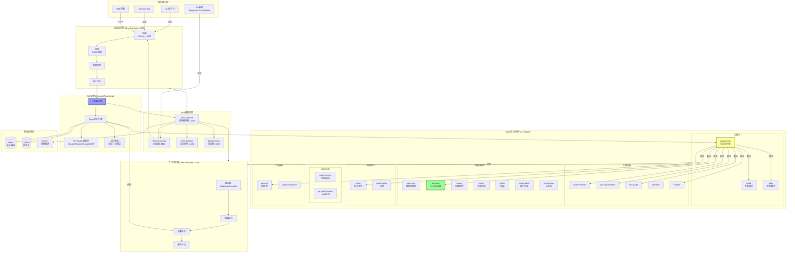
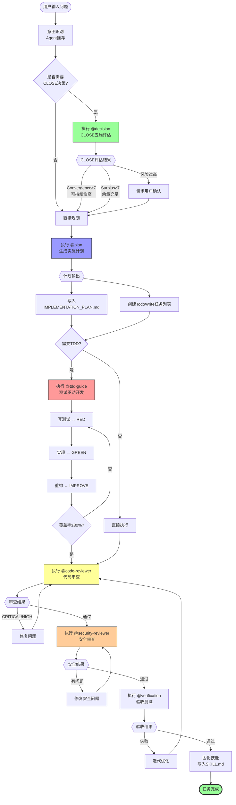
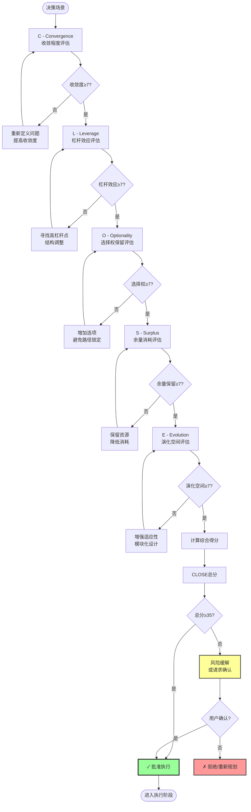
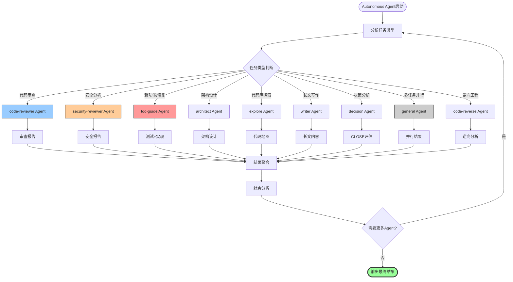
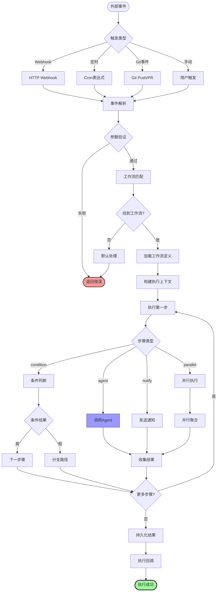
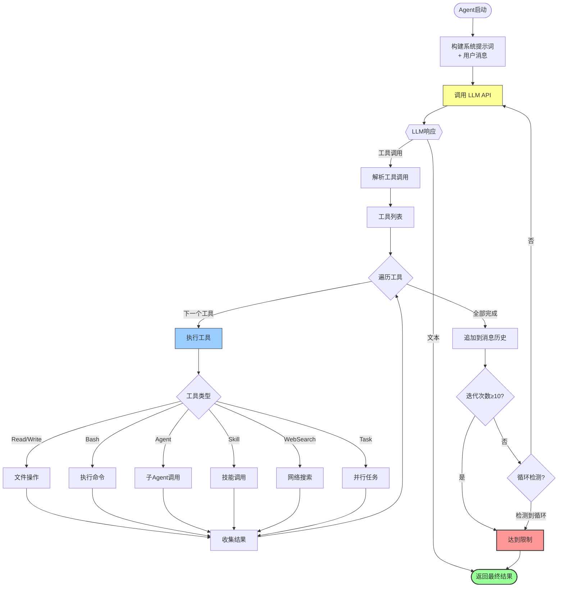
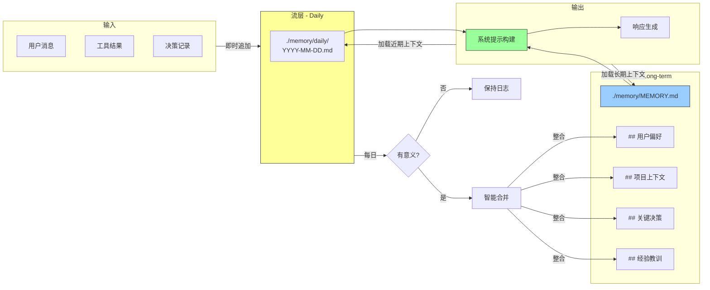
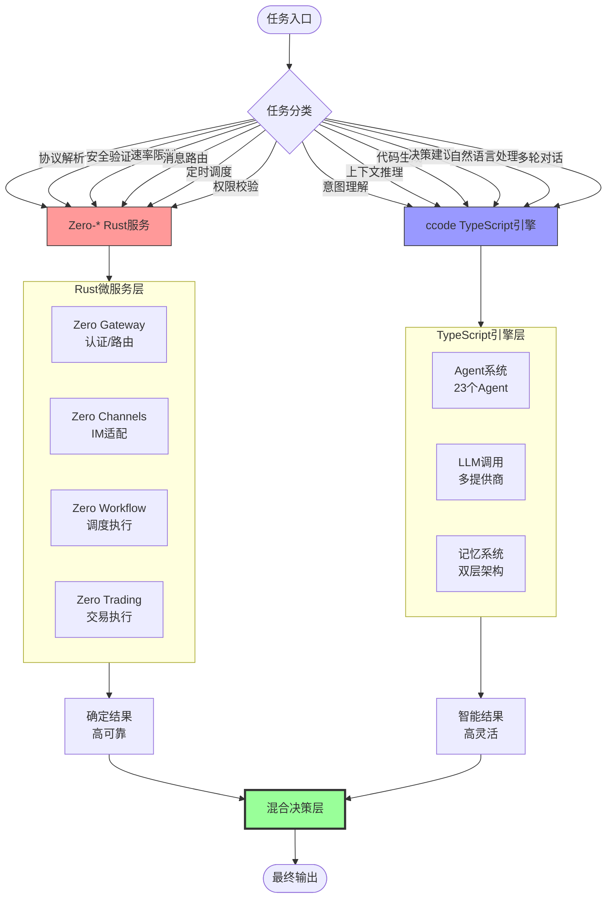
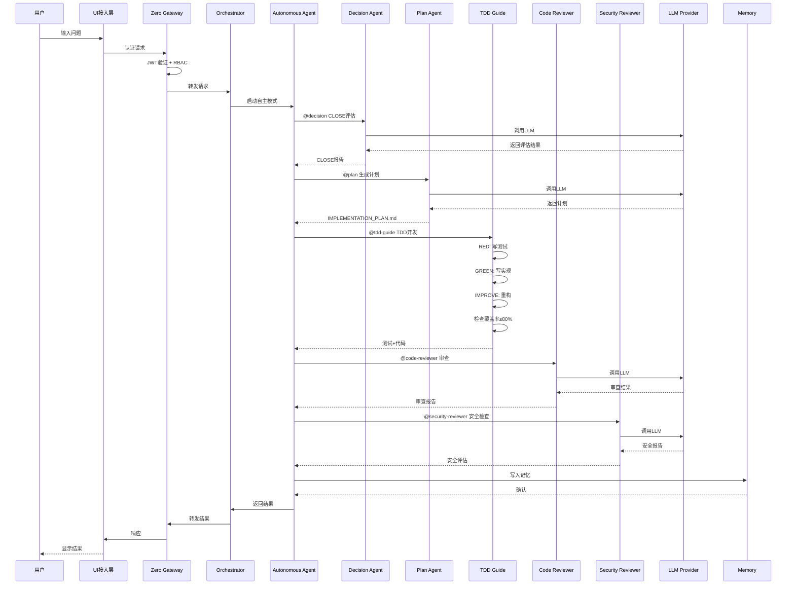

# CodeCoder 全自动自主解决问题流程图

## 完整系统流程图



---

## 自主执行模式核心流程



---

## CLOSE 决策框架评估流程



---

## Agent 委派与协作流程



---

## 工作流触发与执行流程



---

## 工具调用循环 (Tool Calling Loop)



---

## 记忆系统读写流程



---

## 确定性 vs 不确定性任务分流



---

## 完整端到端执行流程示例



---

## 关键设计原则

### 1. 双层架构
```
┌─────────────────────────────────────────┐
│   TypeScript (ccode) - 智能层          │
│   • Agent编排 • LLM调用 • 记忆管理      │
├─────────────────────────────────────────┤
│   Rust (zero-*) - 边界层                │
│   • 安全认证 • 消息路由 • 工作流调度    │
└─────────────────────────────────────────┘
```

### 2. 自主执行七步循环
```
觉醒 → 扩张 → 创造 → 固化 → 验证 → 演化 → 觉醒
  ↑                                                    ↓
  └──────────────────────────────────────────────────┘
```

### 3. CLOSE 五维评估
| 维度 | 说明 | 目标 |
|------|------|------|
| C - Convergence | 收敛程度 | ≥7 |
| L - Leverage | 杠杆效应 | ≥7 |
| O - Optionality | 选择权保留 | ≥7 |
| S - Surplus | 余量消耗 | ≥7 |
| E - Evolution | 演化空间 | ≥7 |

### 4. 可持续性优先
- 保持"再来一次"的能力 > 追求"最优解"
- 回滚机制、Plan Mode、Undo 能力
- 人在回路 (HITL) 关键决策确认

### 5. 面向大模型可改写
- 一致命名、显式类型、声明式配置
- 小文件原则 (200-400行典型)
- 透明记忆 (Markdown + Git)
