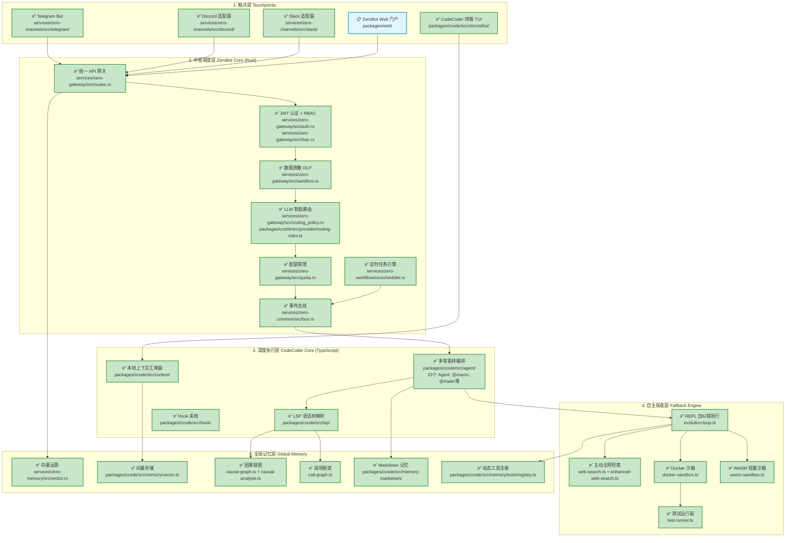
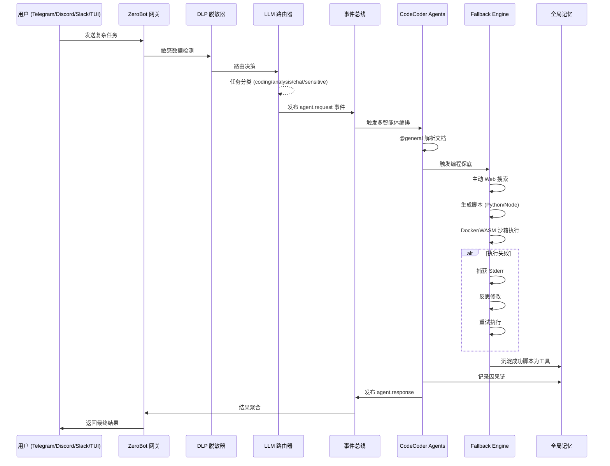

# 架构对比分析：设计目标 vs 实际实现

> 生成时间: 2026-02-24
> 设计文档: `docs/standards/tech-structure.md`

## Context

根据 `docs/standards/tech-structure.md` 中的设计目标（"自主研究、编程保底、全域协同"），对比当前项目的实际实现状态，生成架构图并标注各组件的实现进度。

---

## 实现状态图例

| 状态 | 含义 |
|------|------|
| ✅ 已实现 | 功能完整，可投入生产使用 |
| 🚧 部分实现 | 核心功能存在，但缺少某些特性 |
| 📋 规划中 | 仅有设计或框架代码 |

---

## 五层架构实现状态



---

## 各层详细分析

### 第一层：触点层 (Touchpoints)

| 组件 | 状态 | 文件位置 | 说明 |
|------|------|----------|------|
| Telegram Bot | ✅ 完成 | `services/zero-channels/src/telegram/` | 完整实现：消息收发、语音转写(STT)、文档处理、PDF解析、内联键盘 |
| Discord 适配器 | ✅ 完成 | `services/zero-channels/src/discord/` | 完整实现：Gateway WebSocket 连接、实时消息监听、用户白名单、消息分片发送 |
| Slack 适配器 | ✅ 完成 | `services/zero-channels/src/slack/` | 完整实现：Web API 集成、轮询式消息监听、Mrkdwn 格式转换 |
| Web 门户 | 📋 规划 | `packages/web/` | React + Vite 框架已搭建，核心功能待开发 |
| 终端 TUI | ✅ 完成 | `packages/ccode/src/cli/cmd/tui/` | SolidJS + OpenTUI 实现 |

### 第二层：中枢调度层 (ZeroBot Core)

| 组件 | 状态 | 文件位置 | 说明 |
|------|------|----------|------|
| API 网关 | ✅ 完成 | `services/zero-gateway/src/routes.rs` | Axum HTTP 服务，完整路由体系 |
| JWT 认证 | ✅ 完成 | `services/zero-gateway/src/auth.rs` | 支持用户登录、Token 刷新 |
| RBAC 权限 | ✅ 完成 | `services/zero-gateway/src/rbac.rs` | 角色权限控制 (admin/developer/intern/guest) |
| DLP 数据脱敏 | ✅ 完成 | `services/zero-gateway/src/sandbox.rs` | 30+ 敏感数据模式识别（API密钥、PII、数据库连接串等） |
| LLM 路由 | ✅ 完成 | `routing_policy.rs` + `routing-rules.ts` | 任务分类 + 角色权限 + 敏感数据路由到本地模型 |
| 配额管理 | ✅ 完成 | `services/zero-gateway/src/quota.rs` | 日/月 Token 限额 |
| 事件总线 | ✅ 完成 | `services/zero-common/src/bus.rs` | InMemory + Redis Pub/Sub 双后端，支持通配符订阅 |
| 定时任务 | ✅ 完成 | `services/zero-workflow/src/scheduler.rs` | SQLite 持久化、Cron 表达式、执行历史追踪 |

### 第三层：深度执行层 (CodeCoder Core)

| 组件 | 状态 | 文件位置 | 说明 |
|------|------|----------|------|
| LSP 引擎 | ✅ 完成 | `packages/ccode/src/lsp/` | 语法树解析、代码导航 |
| 多智能体 | ✅ 完成 | `packages/ccode/src/agent/` | 23个领域 Agent（@macro, @trader, @decision 等） |
| 上下文汇聚 | ✅ 完成 | `packages/ccode/src/context/` | 文件指纹、相关性评分、缓存 |
| Hook 系统 | ✅ 完成 | `packages/ccode/src/hook/` | PreToolUse/PostToolUse/Stop 钩子 |

### 第四层：自主保底层 (Fallback Engine) - 系统灵魂

| 组件 | 状态 | 文件位置 | 说明 |
|------|------|----------|------|
| 全网检索 | ✅ 完成 | `web-search.ts`, `enhanced-web-search.ts` | 主动搜索、文档抓取 |
| Docker 沙箱 | ✅ 完成 | `docker-sandbox.ts` | 5种语言支持(Python/Node/Shell/Rust/Go)，资源隔离 |
| WASM 沙箱 | ✅ 完成 | `wasm-sandbox.ts` | QuickJS 轻量执行，50x 启动速度提升 |
| 自纠错执行 | ✅ 完成 | `evolution-loop.ts` | 捕获错误 → 反思修改 → 重试循环 |
| 测试运行器 | ✅ 完成 | `test-runner.ts` | 自动化测试执行 |

### 第五层：全局记忆层 (Global Memory)

| 组件 | 状态 | 文件位置 | 说明 |
|------|------|----------|------|
| 向量运算 (Rust) | ✅ 完成 | `services/zero-memory/src/vector.rs` | 余弦相似度、混合检索合并 |
| 向量存储 (TS) | ✅ 完成 | `packages/ccode/src/memory/vector.ts` | 本地向量存储 |
| 因果链图 | ✅ 完成 | `causal-graph.ts` + `causal-analysis.ts` | Decision→Action→Outcome 链路追踪 |
| 调用图谱 | ✅ 完成 | `call-graph.ts` | 代码依赖关系图 |
| Markdown 记忆 | ✅ 完成 | `packages/ccode/src/memory-markdown/` | 透明双层记忆（流层+沉积层） |
| 动态工具注册 | ✅ 完成 | `packages/ccode/src/memory/tools/registry.ts` | 成功脚本沉淀为工具，版本控制，统计追踪 |

---

## 设计目标达成度

| 目标 | 达成度 | 说明 |
|------|--------|------|
| **自主研究** | ✅ 95% | Web 检索 + 文档解析 + 主动上网搜索 |
| **编程保底** | ✅ 95% | Docker/WASM 双沙箱 + 自纠错循环 |
| **全域协同** | ✅ 90% | 事件总线 + 多 Agent 协作 + 多渠道触点，Web 门户待完善 |

### 总体完成度: **93%**

---

## 数据流示例（高难度任务）



---

## 与设计文档的差异分析

### 超出设计的实现

| 组件 | 设计 | 实际 |
|------|------|------|
| Discord/Slack | 未明确列出 | 完整实现，支持 WebSocket/轮询 |
| WASM 沙箱 | 仅提 Docker | 双沙箱策略，WASM 用于轻量任务 |
| 因果链图 | 仅提图数据库 | TypeScript 原生实现，无需 Neo4j |
| 事件总线 | 建议 NATS/Redis | InMemory + Redis 双后端 |

### 设计中但未完成的部分

| 组件 | 设计描述 | 当前状态 |
|------|----------|----------|
| ZeroBot Web 门户 | 企业级 Web 界面 | 框架存在，功能待开发 |
| 企业 IM (飞书/钉钉) | 触点层入口 | 有 Feishu/DingTalk 文件，待完善 |
| NATS 后端 | 事件总线选项 | 标记为 Future |

---

## 验证步骤

```bash
# 1. 触点层验证
curl http://localhost:4411/health  # Channels 服务

# 2. 网关验证
curl http://localhost:4410/health  # Gateway 服务

# 3. 沙箱验证
cd packages/ccode && bun test test/unit/autonomous/

# 4. 记忆层验证
ls -la ./memory/  # 检查 Markdown 记忆文件

# 5. 事件总线验证
# 启动 Redis 后检查连接
redis-cli PING
```

---

## 相关文档

- 架构设计文档：`docs/standards/tech-structure.md`
- 实现进展文档：`docs/progress/2026-02-24-*.md`
- 端口配置：CodeCoder API (4400), Web (4401), Rust Daemon (4402), Gateway (4410), Channels (4411)
