# CodeCoder 项目功能与架构评估报告

## 一、项目概述

**CodeCoder** 是一个融合工程能力与决策智慧的个人工作台，采用混合架构设计：

- **TypeScript 前端层**：CLI/TUI 界面 + Web 控制台
- **Rust 后端层**：高性能服务集群
- **AI 多模型支持**：15+ 主流 AI 提供商

---

## 二、技术架构

### 2.1 整体架构图

```
┌─────────────────────────────────────────────────────────────┐
│                      用户接口层                               │
├───────────────┬───────────────┬─────────────────────────────┤
│   CLI/TUI     │    Web UI     │     MCP Clients            │
│  (SolidJS)    │   (React)     │  (IDE/Editor 集成)          │
└───────┬───────┴───────┬───────┴─────────────┬───────────────┘
        │               │                     │
        ▼               ▼                     ▼
┌─────────────────────────────────────────────────────────────┐
│              CodeCoder API Server (Bun/Hono)                │
│                      端口: 4400                              │
├─────────────────────────────────────────────────────────────┤
│  Agent 系统  │  工具系统  │  Session 管理  │  Provider 适配  │
└───────────────────────────┬─────────────────────────────────┘
                            │
        ┌───────────────────┼───────────────────┐
        ▼                   ▼                   ▼
┌───────────────┐   ┌───────────────┐   ┌───────────────┐
│ Zero Gateway  │   │ Zero Channels │   │ Zero Workflow │
│   (4404)      │   │   (4405)      │   │   (4406)      │
│ 认证/路由/配额  │   │ 消息频道适配    │   │ 工作流编排      │
└───────────────┘   └───────────────┘   └───────────────┘
        │                   │                   │
        └───────────────────┼───────────────────┘
                            ▼
            ┌───────────────────────────────────┐
            │      Zero CLI Daemon              │
            │         (4402)                    │
            │   统一入口 (组合所有服务)            │
            └───────────────────────────────────┘
```

### 2.2 Monorepo 结构

```
agents-16b238a093/
├── packages/           # TypeScript 包
│   ├── ccode/          # 核心 CLI 工具 (27+ agents, 25+ tools)
│   ├── web/            # Web 前端 (React + Radix UI + TanStack Router)
│   ├── util/           # 共享工具
│   └── memory/         # 记忆系统
├── services/           # Rust 服务
│   ├── zero-cli/       # 主程序 (daemon 命令)
│   ├── zero-gateway/   # 网关服务
│   ├── zero-channels/  # 频道服务 (9+ 平台)
│   ├── zero-workflow/  # 工作流服务
│   ├── zero-common/    # 共享配置
│   ├── zero-memory/    # 持久化 (SQLite)
│   ├── zero-tools/     # 工具定义
│   └── zero-agent/     # Agent 执行
├── docs/               # 文档
├── memory/             # 双层记忆存储
└── script/             # 构建脚本
```

---

## 三、功能模块详解

### 3.1 Agent 系统 (27+ Agents)

| 分类 | Agent | 功能描述 |
|------|-------|----------|
| **主模式** | `build` | 主开发模式，支持代码编写、文件编辑、规划 |
| | `plan` | 计划模式，只读探索 + 详细实现规划 |
| | `autonomous` | 自主模式，使用 CLOSE 决策框架自主执行 |
| **工程质量** | `code-reviewer` | 代码质量审查，提供具体可操作的反馈 |
| | `security-reviewer` | 安全漏洞分析，OWASP Top 10 检查 |
| | `tdd-guide` | TDD 方法论引导，确保测试先行 |
| | `architect` | 系统架构设计，接口定义与模式建立 |
| | `verifier` | 综合验证，构建/类型/lint/测试/覆盖率检查 |
| **代码探索** | `explore` | 快速代码库探索，支持多级深度 |
| | `general` | 通用代理，多步骤任务执行 |
| **逆向工程** | `code-reverse` | 网站逆向分析，像素级还原规划 |
| | `jar-code-reverse` | JAR 文件逆向，Java 源码重建 |
| **内容创作** | `writer` | 长文写作 (20k+ 字)，章节式创作 |
| | `proofreader` | 校对审查，PROOF 框架 |
| | `expander` | 内容扩展，框架构建与一致性验证 |
| | `expander-fiction` | 小说扩展，世界观/角色弧线/叙事结构 |
| | `expander-nonfiction` | 非虚构扩展，论证/证据/推理框架 |
| **祝融说系列** | `observer` | 观察者理论分析，揭示可能性空间 |
| | `decision` | CLOSE 五维评估，可持续决策分析 |
| | `macro` | 宏观经济分析，18 章课程体系 |
| | `trader` | 超短线交易指南，情绪周期/模式识别 |
| | `picker` | 选品专家，七宗罪选品法 |
| | `miniproduct` | 极小产品教练，0-1 可盈利软件构建 |
| | `ai-engineer` | AI 工程师导师，LLM 应用开发 |
| **工具辅助** | `synton-assistant` | SYNTON-DB 助手，张量图存储/PaQL 查询 |
| **系统隐藏** | `compaction`, `title`, `summary` | 上下文压缩、标题生成、摘要生成 |

### 3.2 工具系统 (25+ Tools)

| 类别 | 工具 | 功能 |
|------|------|------|
| **文件操作** | `read`, `write`, `edit`, `apply_patch`, `multiedit` | 文件读写与编辑 |
| **搜索** | `glob`, `grep`, `codesearch`, `ls` | 文件匹配、内容搜索、代码搜索 |
| **执行** | `bash`, `task` | Shell 命令、子代理任务 |
| **网络** | `webfetch`, `websearch`, `network-analyzer` | 网页获取、搜索、网络分析 |
| **开发** | `lsp`, `credential`, `skill` | 语言服务、凭证管理、技能调用 |
| **规划** | `plan`, `todo`, `question` | 计划模式、任务跟踪、用户询问 |
| **注册** | `registry` | Agent 注册与发现 |

### 3.3 AI Provider 支持 (15+ 提供商)

```typescript
// packages/ccode/package.json 中的 AI SDK 依赖
{
  "@ai-sdk/anthropic": "Claude (Opus, Sonnet, Haiku)",
  "@ai-sdk/openai": "GPT-4, GPT-4o, o1, o3",
  "@ai-sdk/google": "Gemini Pro, Flash",
  "@ai-sdk/google-vertex": "Vertex AI",
  "@ai-sdk/amazon-bedrock": "AWS Bedrock",
  "@ai-sdk/azure": "Azure OpenAI",
  "@ai-sdk/cerebras": "Cerebras",
  "@ai-sdk/cohere": "Cohere",
  "@ai-sdk/deepinfra": "DeepInfra",
  "@ai-sdk/groq": "Groq",
  "@ai-sdk/mistral": "Mistral",
  "@ai-sdk/perplexity": "Perplexity",
  "@ai-sdk/togetherai": "Together AI",
  "@ai-sdk/xai": "xAI (Grok)",
  "@openrouter/ai-sdk-provider": "OpenRouter (聚合)",
  "@ai-sdk/openai-compatible": "本地模型 (Ollama, LM Studio)"
}
```

### 3.4 频道集成 (9+ 平台)

Rust `zero-channels` 服务支持：

| 平台 | 文件 | 特性 |
|------|------|------|
| **Telegram** | `bridge.rs` | Bot API, Markdown 转换 |
| **Discord** | `discord.rs` | WebSocket Gateway, 交互式 |
| **Slack** | `slack.rs` | Events API, Block Kit |
| **飞书** | `feishu.rs` | AES 加密解密, 事件订阅 |
| **钉钉** | `dingtalk.rs` | 企业内部应用 |
| **企业微信** | `wecom.rs` | 企业应用消息 |
| **WhatsApp** | `whatsapp.rs` | Cloud API |
| **iMessage** | `imessage.rs` | macOS 数据库轮询 |
| **Matrix** | `matrix.rs` | 开放协议支持 |

### 3.5 工作流引擎

Rust `zero-workflow` 服务：

| 模块 | 功能 |
|------|------|
| `webhook.rs` | Webhook 处理与签名验证 |
| `scheduler.rs` | Cron 定时任务调度 |
| `workflow.rs` | YAML 工作流定义与执行 |
| `review_bridge.rs` | 代码审查集成 |
| `ticket_bridge.rs` | 工单自动化 |
| `monitor_bridge.rs` | 竞品监控 |
| `economic_bridge.rs` | 经济数据桥接 |
| `risk_monitor.rs` | 风险监控 |
| `trading_review.rs` | 交易复盘 |

### 3.6 Web 前端 (React)

关键页面：

| 页面 | 功能 |
|------|------|
| `Dashboard.tsx` | 控制台首页 |
| `Session.tsx` | 会话详情与消息流 |
| `Sessions.tsx` | 会话列表管理 |
| `Agents.tsx` | Agent 配置与选择 |
| `Tasks.tsx` | 任务跟踪 |
| `Memory.tsx` | 记忆系统可视化 |
| `Settings.tsx` | 配置管理 |
| `Projects.tsx` | 项目工作区 |
| `Infrastructure.tsx` | 基础设施 (Gateway/Cron/Tunnel) |
| `Skills.tsx` | 技能管理 |
| `Workflows.tsx` | 工作流编辑 |
| `Knowledge.tsx` | 知识库管理 |
| `Compare.tsx` | 对比分析 |
| `Chat.tsx` | 对话界面 |
| `Admin.tsx` | 管理后台 |

组件库基于 Radix UI：

- Dialog, Dropdown, Select, Tabs, Toast, Tooltip
- ScrollArea, Collapsible, AlertDialog
- 自定义：MessageList, AgentCard, ModelSelector

---

## 四、API Server 架构

`packages/ccode/src/api/server/` 结构：

```
handlers/
├── agent.ts          # Agent CRUD
├── assess.ts         # 可行性评估
├── channel.ts        # 频道管理
├── chat.ts           # 对话处理
├── compare.ts        # 对比分析
├── config.ts         # 配置管理
├── credential.ts     # 凭证存储
├── directory.ts      # 目录浏览
├── document.ts       # 文档处理
├── event.ts          # 事件流 (SSE)
├── executive.ts      # 高管仪表盘
├── executive-ws.ts   # WebSocket 推送
├── find.ts           # 文件查找
├── hooks.ts          # Hook 管理
├── knowledge.ts      # 知识库
├── lsp.ts            # LSP 代理
├── mcp.ts            # MCP 服务器
├── memory.ts         # 记忆读写
├── metering.ts       # 用量计量
├── permission.ts     # 权限管理
├── project.ts        # 项目管理
├── provider.ts       # Provider 配置
├── registry.ts       # Agent 注册表
├── session.ts        # 会话管理
├── skill.ts          # 技能调用
└── task.ts           # 任务管理
```

---

## 五、哲学框架 (祝融说)

项目内置基于"祝融说"的决策与认知系统：

### 5.1 核心理念

| 概念 | 含义 |
|------|------|
| **可能性基底** | 宇宙的终极实在是包含一切潜能的无限场域 |
| **观察即收敛** | 观察是创造性行为，导致可能性"坍缩"为确定性 |
| **可用余量** | 尚未被固化的潜能空间，是自由意志和创造力的来源 |
| **可持续决策** | 保持"再来一次"的能力比追求"最优解"更重要 |

### 5.2 CLOSE 决策框架

| 维度 | 评估内容 |
|------|----------|
| **C** (Continuity) | 延续性：选择后能否继续选择 |
| **L** (Leverage) | 杠杆性：投入产出比 |
| **O** (Optionality) | 可选性：保留多少选项 |
| **S** (Sustainability) | 可持续性：长期运行能力 |
| **E** (Exit) | 退出性：能否优雅退出 |

---

## 六、记忆系统

双层透明记忆架构：

```
memory/
├── daily/              # 流层 (每日笔记)
│   └── {YYYY-MM-DD}.md # 按时间顺序的仅追加日志
└── MEMORY.md           # 沉积层 (长期记忆)
                        # 分类的结构化知识
```

### 操作规则

1. **上下文加载**：读取 MEMORY.md + 当日笔记
2. **即时持久化**：重要交互追加到当日笔记
3. **长期整合**：有意义的信息合并到 MEMORY.md

---

## 七、端口配置

| 服务 | 端口 | 技术栈 |
|------|------|--------|
| CodeCoder API Server | 4400 | Bun/Hono |
| Web Frontend (Vite) | 4401 | React |
| Zero CLI Daemon | 4402 | Rust/Axum (组合服务) |
| Faster Whisper Server | 4403 | Docker |
| Zero Gateway | 4404 | Rust/Axum |
| Zero Channels | 4405 | Rust/Axum |
| Zero Workflow | 4406 | Rust/Axum |

---

## 八、构建与运行

```bash
# 开发
bun install
bun dev              # TUI 模式
bun dev serve        # API 服务器模式
bun dev:web          # Web 前端

# 运维
./ops.sh start       # 启动核心服务
./ops.sh start all   # 启动所有服务
./ops.sh stop        # 停止服务
./ops.sh status      # 查看状态

# Rust 服务
./ops.sh build rust  # 构建 Rust 服务
cargo test -p zero-channels  # 测试特定 crate
```

---

## 九、架构亮点

### 9.1 多模型统一抽象

通过 Vercel AI SDK 实现 15+ 提供商的统一接口，支持：
- 流式输出
- 工具调用
- 结构化输出 (JSON Schema)
- 扩展思考 (Extended Thinking)

### 9.2 权限系统

基于规则的细粒度权限控制：

```typescript
permission: {
  "*": "allow",
  doom_loop: "ask",
  external_directory: { "*": "ask" },
  read: { "*.env": "ask" }
}
```

### 9.3 Agent 注册表

动态 Agent 发现与推荐：
- 能力声明 (Capabilities)
- 触发条件 (Triggers)
- 模糊搜索 (Fuse.js)
- 分类组织

### 9.4 MCP 协议支持

通过 `@modelcontextprotocol/sdk` 支持：
- MCP 服务器集成
- 工具动态注册
- 资源提供

---

## 十、评估总结

### 优势

1. **完整的 AI 工程工作台**：从代码开发到决策分析的全流程覆盖
2. **多模型灵活切换**：15+ 提供商，成本与能力平衡
3. **哲学与工程融合**：祝融说决策框架提供独特的思维工具
4. **混合架构**：TypeScript 灵活性 + Rust 性能
5. **透明记忆系统**：Git 友好，人类可读

### 潜在改进点

1. **文档完善度**：部分 Rust 服务缺少详细 API 文档
2. **测试覆盖**：需要更多集成测试和 E2E 测试
3. **部署简化**：可考虑 Docker Compose 一键部署
4. **监控可观测**：结构化日志已规划，需要完整实现

### 适用场景

- 个人开发者日常编码与决策
- AI 辅助的代码审查与安全分析
- 长文内容创作与校对
- 宏观经济与交易分析学习
- 选品与极小产品方法论实践

---

## 十一、全生命周期时序图

### 11.1 CLI/Web 触发流程


**Mermaid 源文件**: [codecoder-lifecycle.mmd](../diagrams/codecoder-lifecycle.mmd)

```mermaid
sequenceDiagram
    autonumber

    participant User as 👤 用户
    participant UI as 🖥️ CLI/TUI/Web
    participant API as 📡 API Server (Bun/Hono:4400)
    participant Agent as 🤖 Agent 系统
    participant Tools as 🔧 工具系统
    participant Provider as 🧠 AI Provider (Claude/GPT/Gemini)
    participant Memory as 💾 记忆系统
    participant Rust as ⚡ Rust 服务 (Gateway/Channels/Workflow)

    rect rgb(40, 44, 52)
        Note over User,Memory: 📋 Phase 1: 会话初始化
        User->>UI: 启动 CodeCoder
        UI->>API: POST /session/create
        API->>Memory: 加载上下文
        Memory-->>API: MEMORY.md + daily/{date}.md
        API->>Agent: 初始化 Agent Registry
        Agent-->>API: 可用 agents 列表
        API-->>UI: Session ID + 初始状态
        UI-->>User: 显示欢迎界面
    end

    rect rgb(30, 40, 60)
        Note over User,Memory: 💬 Phase 2: 用户输入处理
        User->>UI: 输入消息/命令
        alt Slash Command (/commit, /review-pr)
            UI->>API: POST /skill/invoke
        else @Agent Mention (@decision, @macro)
            UI->>API: 指定 Agent 调用
        else 普通消息
            UI->>API: POST /session/{id}/message
            API->>Agent: 意图识别 (Trigger 匹配)
        end
        API->>Agent: 选择执行 Agent
    end

    rect rgb(50, 40, 50)
        Note over User,Rust: 🔄 Phase 3: Agent 执行循环 (Agentic Loop)
        loop 直到任务完成或达到 max_turns
            Agent->>Provider: 发送系统提示 + 对话历史
            Provider-->>Agent: 流式响应 (text / tool_use)
            alt Tool 调用
                Agent->>Tools: 解析 tool_use
                Tools-->>Agent: Tool 结果
            end
        end
    end

    rect rgb(40, 44, 52)
        Note over User,Memory: ✅ Phase 5: 响应完成与持久化
        Agent->>API: 响应完成
        API->>Memory: 追加到 daily/{date}.md
        API-->>UI: 完成信号 + 元数据
        UI-->>User: 显示最终响应
    end
```



### 11.2 IM 消息触发流程 (Telegram/Discord/Slack/飞书/钉钉)


**Mermaid 源文件**: [im-trigger-flow.mmd](../diagrams/im-trigger-flow.mmd)

```mermaid
sequenceDiagram
    autonumber

    participant IM as 📱 IM 平台 (Telegram/Discord/Slack/飞书)
    participant Webhook as 🔗 zero-channels (Rust:4405)
    participant Bridge as 🌉 CodeCoderBridge
    participant Router as 📤 OutboundRouter
    participant API as 📡 API Server (Bun/Hono:4400)
    participant Agent as 🤖 Agent 系统
    participant Provider as 🧠 AI Provider

    rect rgb(40, 50, 60)
        Note over IM,Webhook: 📥 Phase 1: Webhook 接收
        IM->>Webhook: POST /webhook/{platform}
        Note right of Webhook: 验证签名 (HMAC/SHA256)
        Webhook->>Webhook: 解析 ChannelMessage
    end

    rect rgb(50, 40, 50)
        Note over Webhook,Bridge: 🎯 Phase 2: 意图识别
        Webhook->>Bridge: process(ChannelMessage)
        alt 内容捕获请求
            Bridge->>API: POST /api/v1/capture
        else 技术可行性问题
            Bridge->>API: POST /api/v1/assess/feasibility
        else A/B 测试
            Bridge->>API: POST /api/v1/compare
        else 知识库查询
            Bridge->>API: POST /api/v1/knowledge/search
        else Bug 报告
            Bridge->>API: POST /api/v1/ticket/bug
        else 普通对话
            Bridge->>API: POST /api/v1/chat
        end
    end

    rect rgb(40, 50, 40)
        Note over API,Provider: 🤖 Phase 3: Agent 处理
        API->>Agent: 分发到对应 Agent
        loop Agentic Loop
            Agent->>Provider: 发送 prompt
            Provider-->>Agent: 流式响应 / tool_use
        end
        Agent-->>API: 最终响应
    end

    rect rgb(50, 50, 40)
        Note over API,IM: 📤 Phase 4: 响应路由
        API-->>Bridge: ChatResponse / AssessmentResult
        Bridge->>Router: respond(message_id, content)
        Router->>IM: POST /sendMessage
        IM-->>IM: 显示回复
    end
```



### 11.3 频道适配器支持的平台

| 平台 | 入口方式 | 特殊功能 |
|------|----------|----------|
| **Telegram** | Bot Webhook | Markdown v2, 内联键盘 |
| **Discord** | WebSocket Gateway | Embed, 交互组件 |
| **Slack** | Events API | Block Kit, 模态框 |
| **飞书** | 事件订阅 (AES 加密) | 富文本卡片 |
| **钉钉** | 企业内部应用 | 卡片消息 |
| **企业微信** | 回调事件 | 图文消息 |
| **WhatsApp** | Cloud API | 模板消息 |
| **iMessage** | macOS 数据库轮询 | 仅 macOS |
| **Matrix** | Webhook | 开放协议 |

### 11.4 意图识别规则 (`bridge.rs`)

```rust
// 技术可行性问题
let cn_patterns = [
    r"技术.*复杂.*吗",     // "技术复杂度高吗"
    r"能.*实现.*吗",       // "这个功能能实现吗"
    r"需要.*改动.*多少",   // "需要改动多少文件"
    r"可行性.*[如何怎样]", // "可行性如何"
];

// A/B 测试请求
r"@a/?b\s+(.+)"       // "@A/B 生成一篇推文"
r"@(?:对比|比较)\s+(.+)" // "@对比 写一个产品介绍"

// 知识库查询
r"@(?:知识库|知识)\s+(.+)" // "@知识库 公司产品"
r"(?:帮我)?查(?:[询问])?一?下\s*(.+)" // "帮我查一下入职流程"

// Bug 报告
r"(崩溃|crash|白屏|黑屏)"  // 崩溃类
r"(报错|error|异常)"       // 错误类
r"(无法|不能).{0,10}(登录|打开)" // 功能类
```

### 时序图说明

| 阶段 | 关键步骤 | 涉及组件 |
|------|----------|----------|
| **Phase 1** | 会话初始化 | UI → API → Memory → Agent Registry |
| **Phase 2** | 输入处理 & Agent 选择 | UI → API → Agent (Trigger 匹配) |
| **Phase 3** | Agentic Loop | Agent ↔ Provider ↔ Tools ↔ Rust |
| **Phase 4** | 频道/工作流集成 | Rust Services ↔ API ↔ Agent |
| **Phase 5** | 响应完成 & 持久化 | Agent → API → Memory |
| **Phase 6** | 会话归档 | API → title/summary agents → Memory |

### 核心流程特点

1. **流式响应**：Agent 通过 SSE 实时推送文本块到 UI
2. **权限检查**：每个 Tool 调用前检查 allow/ask/deny 规则
3. **子代理递归**：Task 工具可启动新的 Agent 执行子任务
4. **双层记忆**：即时写入 daily 日志，重要信息合并到 MEMORY.md
5. **多入口**：CLI/TUI/Web/外部频道均可触发 Agent

---

**SVG 文件位置**: `docs/diagrams/codecoder-lifecycle.svg`, `docs/diagrams/im-trigger-flow.svg`
**Mermaid 源文件**: `docs/diagrams/codecoder-lifecycle.mmd`, `docs/diagrams/im-trigger-flow.mmd`

---

*评估时间：2026-02-22*
