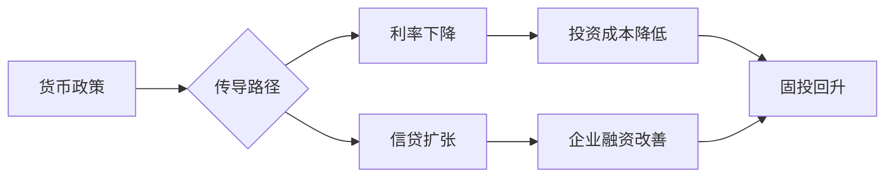
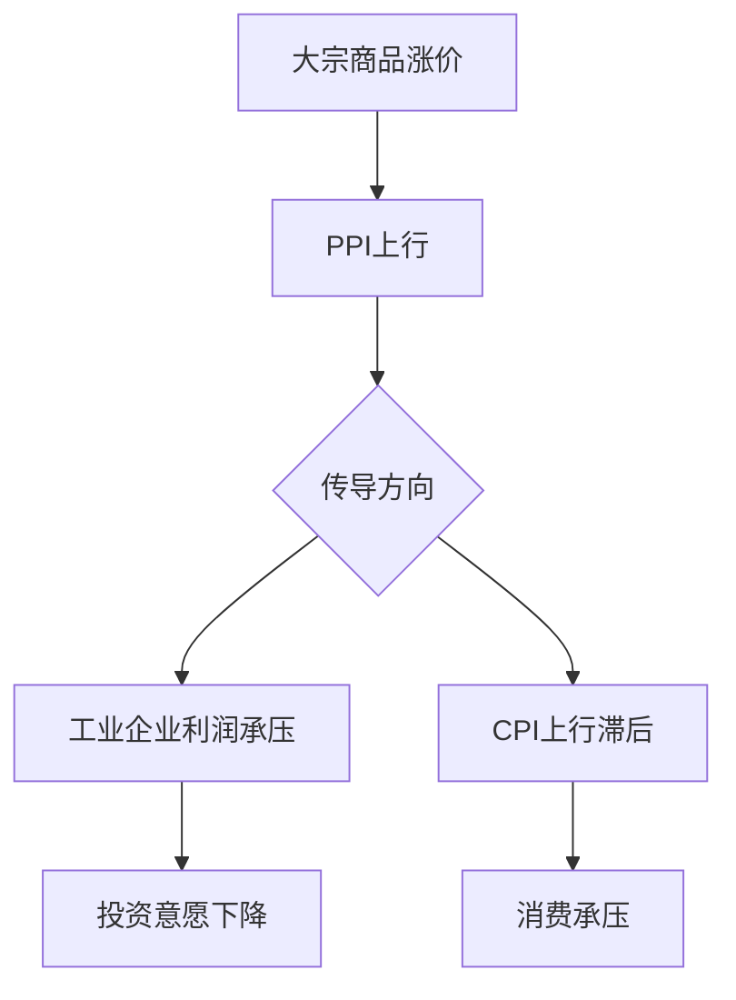
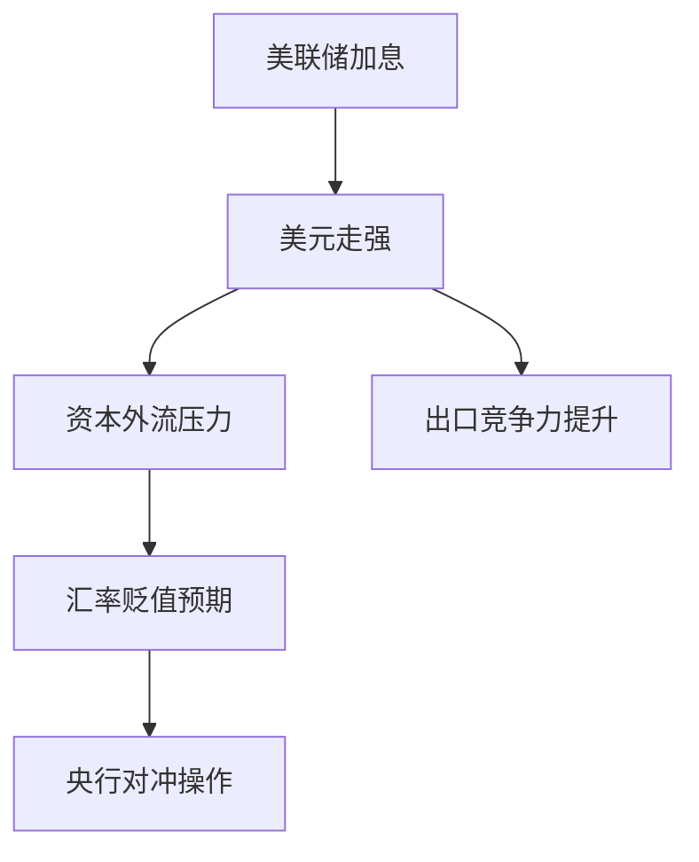
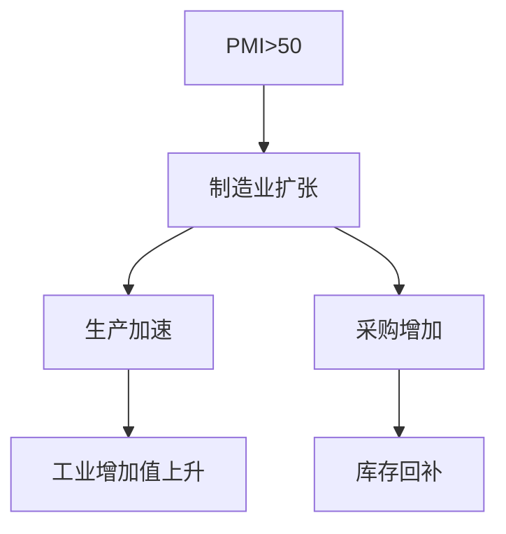

# Phase 5: 投研量化功能 - 完成报告

**完成时间**: 2026-02-25
**状态**: ✅ 已完成

## 概述

实现了 goals.md 中的投研量化功能，包括经济因果链图谱可视化和余量风控告警系统。

## 功能实现状态

### F-FIN-01: 经济因果链图谱 ✅

**实现文件**:
- `packages/ccode/src/agent/prompt/macro.txt` - 宏观分析 Agent (增强)
- `services/zero-workflow/src/economic_bridge.rs` - 经济数据桥接

**功能描述**: 增强 @macro Agent 输出可视化数据

**新增 Mermaid 图谱模板**:

1. **货币政策传导链**


2. **价格传导链**


3. **外部冲击传导链**


**使用示例**:
```bash
# 生成因果链分析
@macro 分析本月社融数据对实体经济的传导路径，输出Mermaid图谱

# 预期输出
## 分析结论
社融放量 → 企业融资改善 → 投资回升 → 工业生产加速

## 因果链图谱
[Mermaid flowchart 输出]
```

### F-FIN-04: 余量风控告警 ✅

**实现文件**: `services/zero-workflow/src/risk_monitor.rs`

**功能描述**: 定时持仓监控和阈值告警，告警推送到 IM 频道

**核心类型**:

| 类型 | 说明 |
|------|------|
| `MarginCategory` | Token配额、预算、频率限制、存储、计算、时间、决策余量 |
| `AlertSeverity` | Info/Warning/Critical/Emergency |
| `RiskAlertType` | 阈值超限/高燃耗/即将耗尽/已耗尽/已恢复 |

**告警阈值配置**:
```rust
pub struct AlertThreshold {
    pub info: f64,      // 60% 默认
    pub warning: f64,   // 75% 默认
    pub critical: f64,  // 90% 默认
    pub emergency: f64, // 98% 默认
}
```

**核心功能**:
- `register_margin()` - 注册监控项
- `update_usage()` - 更新使用量并检查告警
- `check_margin()` - 检查是否触发告警
- `send_notification()` - 发送 IM 告警通知
- `load_from_metering()` - 从配额系统加载数据

**告警消息格式**:
```markdown
⚠️ Token配额告警 (用户: zhangsan)

📊 使用率: 85.2%
📉 剩余: 14800 tokens
⏱️ 预计耗尽: 4.5 小时后

💡 建议:
  - 优化 prompt 减少 token 消耗
  - 申请配额提升
```

**配置示例**:
```json
{
  "risk_monitor": {
    "default_thresholds": {
      "info": 60.0,
      "warning": 75.0,
      "critical": 90.0,
      "emergency": 98.0
    },
    "depletion_warning_hours": 24.0,
    "channels_endpoint": "http://localhost:4431",
    "notification_channel_type": "feishu",
    "notification_channel_id": "dev-ops-group"
  }
}
```

### 经济数据监控 (附加功能)

**实现文件**: `services/zero-workflow/src/economic_bridge.rs`

**支持的指标**:
- CPI/PPI - 物价指数
- GDP - 国内生产总值
- PMI - 采购经理指数
- 利率、失业率、工业生产、零售销售
- M2、社融

**数据源**:
- FRED (美联储经济数据)
- Alpha Vantage
- 中国国家统计局 (NBS)
- 自定义 API

**异常检测**:
```rust
pub enum AlertType {
    AboveThreshold,    // 超过阈值
    BelowThreshold,    // 低于阈值
    SignificantChange, // 显著变化
    TrendReversal,     // 趋势反转
    DataRelease,       // 新数据发布
}
```

## 架构图

```
┌────────────────────────────────────────────────────────────────────┐
│                    投研量化功能架构                                 │
│                                                                    │
│  ┌────────────────────────┐     ┌────────────────────────┐        │
│  │    @macro Agent        │     │   risk_monitor.rs      │        │
│  │  ┌────────────────┐    │     │  ┌────────────────┐    │        │
│  │  │  数据联动分析   │    │     │  │  Margin 监控   │    │        │
│  │  └───────┬────────┘    │     │  └───────┬────────┘    │        │
│  │          │             │     │          │             │        │
│  │  ┌───────▼────────┐    │     │  ┌───────▼────────┐    │        │
│  │  │  Mermaid 图谱   │    │     │  │  阈值告警检测  │    │        │
│  │  └───────┬────────┘    │     │  └───────┬────────┘    │        │
│  └──────────┼─────────────┘     └──────────┼─────────────┘        │
│             │                              │                       │
│             ▼                              ▼                       │
│  ┌────────────────────────────────────────────────────────┐       │
│  │                   zero-channels                         │       │
│  │        (Feishu / WeCom / DingTalk / Telegram)          │       │
│  └────────────────────────────────────────────────────────┘       │
│                                                                    │
│  ┌────────────────────────┐                                       │
│  │  economic_bridge.rs    │                                       │
│  │  ┌────────────────┐    │                                       │
│  │  │  数据拉取      │    │                                       │
│  │  │ FRED/AV/NBS   │    │                                       │
│  │  └───────┬────────┘    │                                       │
│  │          │             │                                       │
│  │  ┌───────▼────────┐    │                                       │
│  │  │  异常检测      │    │                                       │
│  │  │ (趋势/阈值)   │    │                                       │
│  │  └────────────────┘    │                                       │
│  └────────────────────────┘                                       │
└────────────────────────────────────────────────────────────────────┘
```

## 验证方法

### 因果链图谱验证
```bash
# 使用 macro agent 生成分析
bun dev @macro "分析最新PMI数据，输出因果链Mermaid图谱"

# 预期输出
## PMI 分析
- 制造业PMI: 51.2 (扩张区间)
- 新订单指数: 52.5 (需求改善)

## 因果链图谱

```

### 余量风控验证
```bash
# 注册测试 margin
curl -X POST http://localhost:4432/api/v1/risk/margins \
  -H "Content-Type: application/json" \
  -d '{
    "id": "token-test",
    "name": "测试Token配额",
    "category": "token_quota",
    "owner": "test_user",
    "total": 100000,
    "used": 85000,
    "unit": "tokens"
  }'

# 预期：触发 Warning 级别告警 (85%)
```

### 告警通知验证
```bash
# 检查飞书群是否收到告警
# 消息格式：
# ⚠️ Token配额告警 (用户: test_user)
# 📊 使用率: 85.0%
# 📉 剩余: 15000 tokens
```

## 修改文件清单

### 修改
- `packages/ccode/src/agent/prompt/macro.txt` - 添加 Mermaid 因果链图谱模板

### 已有实现（无需修改）
- `services/zero-workflow/src/risk_monitor.rs` - 完整的余量监控系统
- `services/zero-workflow/src/economic_bridge.rs` - 经济数据监控

## 祝融说哲学整合

RiskMonitor 基于祝融说的"可用余量"概念设计：

> "可持续决策 > 最优决策"

- **Margin 概念**: 各类资源的可用余量（Token、预算、计算资源等）
- **余量消耗**: 追踪 burn rate，预测耗尽时间
- **及时告警**: 在余量不足前发出预警，保持"再来一次"的能力
- **决策余量**: 特殊类别，追踪决策空间的缩小

## 后续增强（可选）

1. **交互式图谱**: 在 Web 界面渲染 Mermaid 图谱
2. **历史趋势**: 显示余量消耗历史曲线
3. **预测模型**: 基于历史数据预测未来消耗
4. **自动扩容**: 告警触发后自动申请资源扩容

## 结论

Phase 5 投研量化功能已完成：
- ✅ F-FIN-01 经济因果链图谱（Mermaid 可视化）
- ✅ F-FIN-04 余量风控告警（IM 推送）

可以继续进行 Phase 6 管理后台与合规功能。
