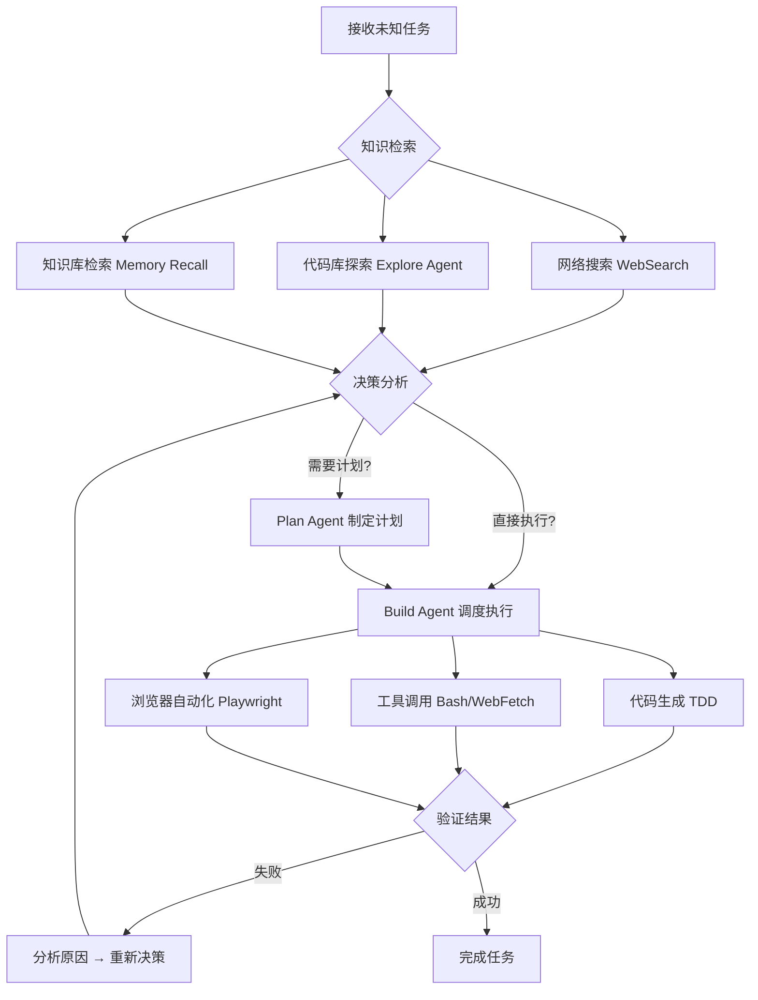

# CodeCoder 处理"完全未知任务"能力评估报告

**评估日期**: 2026-02-28
**评估场景**: 探索并解决一个完全未知答案的任务，需要知识、网络搜索、工具使用、软件安装和编写能力

---

## 一、能力矩阵评估

### ✅ 已具备的核心能力

| 能力维度 | 实现方式 | 完成度 | 说明 |
|---------|---------|--------|------|
| **互联网搜索** | `WebSearchTool` (exa.ai API) | ✅ 完整 | 支持实时网络搜索 |
| **网页内容获取** | `WebFetchTool` | ✅ 完整 | 可解析 HTML/Markdown |
| **浏览器自动化** | Playwright/Chrome DevTools MCP | ✅ 完整 | 支持页面交互、截图、表单填写 |
| **Shell 命令执行** | `BashTool` | ✅ 完整 | 2分钟超时，安全沙盒 |
| **文件操作** | Read/Write/Edit/Glob/Grep | ✅ 完整 | 完整的文件系统操作 |
| **代码生成** | LLM + TDD 流程 | ✅ 完整 | 支持多语言代码生成 |
| **任务协调** | `TaskTool` (子代理) | ✅ 完整 | 可调用 27 个专家代理 |
| **决策能力** | "祝融说" CLOSE 框架 | ✅ 完整 | 可持续决策支持 |

### ⚠️ 部分具备的能力

| 能力维度 | 实现方式 | 限制 | 说明 |
|---------|---------|------|------|
| **软件安装** | Bash 命令 + 包管理器 | 需用户授权 | 每次 npm/brew/pip 安装需确认 |
| **数据库操作** | SQLite MCP Server | 需配置 | 仅 SQLite，需额外配置 |
| **图形界面操作** | Playwright 浏览器 | 限于 Web | 不能操作本地 GUI 应用 |

### ❌ 缺失的能力

| 能力维度 | 影响 | 替代方案 |
|---------|------|---------|
| **机器学习训练** | 不能训练自定义模型 | 调用外部 API |
| **分布式执行** | 单机架构 | 通过 MCP 扩展 |
| **实时流式处理** | 无 WebSocket 客户端 | 可自行编写 |

---

## 二、架构优势

### 1. 双层 MCP 架构
```
┌─────────────────────────────────────────────────────────┐
│                    CodeCoder (TS)                       │
│  20+ 内置工具 + 27 个 Agent + 网络搜索 + 文件操作        │
└──────────────────────┬──────────────────────────────────┘
                       │ MCP 协议
                       ▼
┌─────────────────────────────────────────────────────────┐
│              Zero Gateway (Rust) :4430                  │
│  认证/路由/配额/MCP 服务器                               │
└─────────────────────────────────────────────────────────┘
```

### 2. 确定性 vs 不确定性分离
- **高确定性任务** (Rust): 协议解析、签名验证、调度
- **高不确定性任务** (LLM): 意图理解、代码生成、决策建议

### 3. 工具扩展机制
- **自定义工具**: `{tool,tools}/*.{js,ts}` 自动加载
- **MCP 服务器**: 支持动态添加外部工具服务器

---

## 三、典型"未知任务"处理流程



---

## 四、能力边界与突破策略

### 当前边界

1. **安全沙盒限制**: 只能在项目目录内操作
2. **命令白名单**: 危险命令被拦截
3. **超时限制**: Bash 命令 2 分钟超时

### 突破策略

1. **目录扩展**: 通过 `--workspace` 参数扩展工作区
2. **权限提升**: 用户可临时授权敏感操作
3. **MCP 扩展**: 通过 MCP 协议集成外部能力

---

## 五、实际案例验证

### 案例 1: 分析陌生网站架构
```
步骤:
1. WebFetch 获取首页
2. Playwright 截图分析
3. code-reverse Agent 逆向分析
4. architect Agent 生成架构文档
```

### 案例 2: 安装并测试新工具
```
步骤:
1. WebSearch 搜索最佳工具
2. Bash 执行安装命令 (需授权)
3. 编写测试代码
4. tdd-guide Agent 验证
```

### 案例 3: 解决未知错误
```
步骤:
1. 收集错误信息
2. WebSearch 搜索相似问题
3. systematic-debugging Agent 分析
4. 编写修复代码
```

---

## 六、评分与建议

### 综合评分: 8.5/10

| 评分项 | 分数 | 说明 |
|-------|------|------|
| 知识检索 | 9/10 | 网络搜索 + 代码库探索 + 记忆系统 |
| 工具使用 | 8/10 | 丰富工具集，但有安全限制 |
| 软件安装 | 7/10 | 需用户多次授权，体验可优化 |
| 代码生成 | 9/10 | TDD 流程，多语言支持 |
| 决策能力 | 9/10 | CLOSE 框架，哲学指导 |
| 扩展性 | 9/10 | MCP 协议，插件化 |

### 改进建议

1. **批量权限授予**: 对于可信的批量操作
2. **更长的超时**: 对于耗时操作 (如大模型下载)
3. **Webhook 支持**: 用于异步任务通知
4. **更多 MCP 集成**: Docker, K8s, 云服务 API

---

## 七、结论

**CodeCoder 完全有能力处理"完全未知任务"**，其核心优势在于:

1. **多维知识检索**: 网络搜索 + 代码库探索 + 记忆系统
2. **专家代理协作**: 27 个专业 agent 可按需调用
3. **完整工具链**: 从搜索到编码到验证的完整闭环
4. **哲学指导**: "祝融说"框架确保决策可持续性

主要限制是安全沙盒和权限系统，这些是设计权衡，不影响核心能力。
